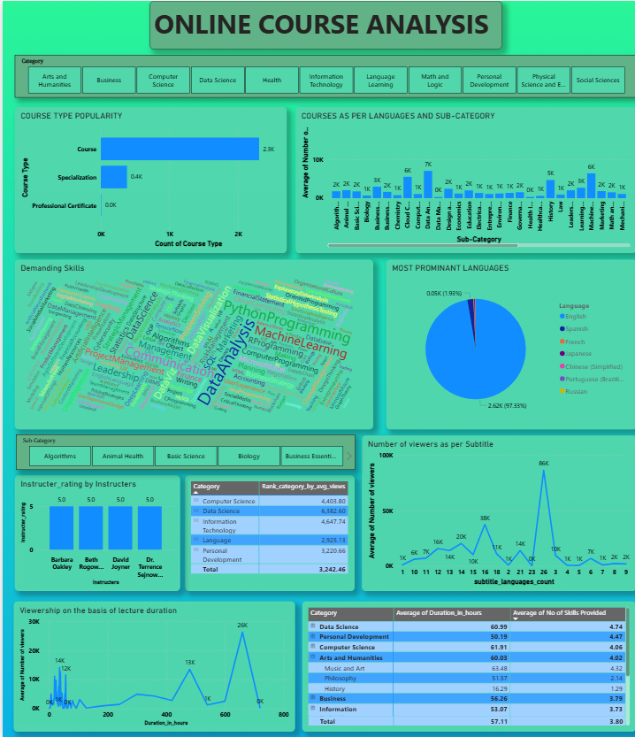

#  Online Course Analysis Dashboard (Power BI)

## 🔹 Overview
This project analyzes online course data to uncover category-wise trends, learner engagement patterns, and strategic opportunities for a startup offering recorded lecture services.

The dashboard is built using Power BI and provides actionable insights to help improve content strategy, accessibility, and user engagement.

---

## 🎯 Business Objectives

- Analyze distribution of course types across categories  
- Count number of courses by category and sub-category  
- Calculate average views by category, sub-category, and language  
- Identify most in-demand skills across categories  
- Analyze distribution of course languages  
- Determine language preferences for top 5 categories  
- Investigate impact of subtitles on views  
- Identify top 3 instructors by ratings  
- Analyze course duration vs viewer engagement  
- Evaluate impact of skill variety on viewership  

---

## 📷 Dashboard Preview

---

## 🔍 Key Insights

### 📌 Category-wise Trends
- Computer Science and Data Science dominate in engagement and course volume  
- Personal Development shows stable demand  

### 📌 Course Type Distribution
- Short courses are more popular than certifications  
- Certifications show potential growth opportunity  

### 📌 Viewer Engagement
- High variation in average views across categories  
- Technical sub-categories attract more engagement  

### 📌 Skills in Demand
- Data Analysis  
- Machine Learning  
- Programming  
- Python  

### 📌 Language Distribution
- English dominates (~97% of courses)  
- Other languages are minimally represented  

### 📌 Language Preferences
- Strong preference for English across all top categories  
- Opportunity for localized content  

### 📌 Subtitles vs Views
- Courses with subtitles have higher engagement  
- Accessibility improves reach  

### 📌 Instructor Performance
- Top instructors consistently maintain high ratings and views  
- Ideal candidates for partnerships  

### 📌 Course Duration vs Engagement
- Courses around 500–650 hours perform best  
- Very short or very long courses underperform  

### 📌 Skills Variety Impact
- Courses with multiple skills attract more viewers  
- Learners prefer comprehensive content  

---

## 🛠 Tools & Technologies

- Power BI  
- DAX (Data Analysis Expressions)  
- Power Query (Data Cleaning & Transformation)  

---

##  How to Use

1. Download the `.pbix` file  
2. Open in Power BI Desktop  
3. Explore the dashboard using filters and visuals  

---

## 🚀 Business Impact

- Helps identify high-demand categories and skills  
- Improves accessibility via subtitles and language insights  
- Supports instructor collaboration decisions  
- Optimizes course duration strategy  
- Highlights content expansion opportunities  
 

---

## 👤 Author

Your Name  
Mohit 

---

## ⭐ If you found this useful

Feel free to star the repository and share feedback!
